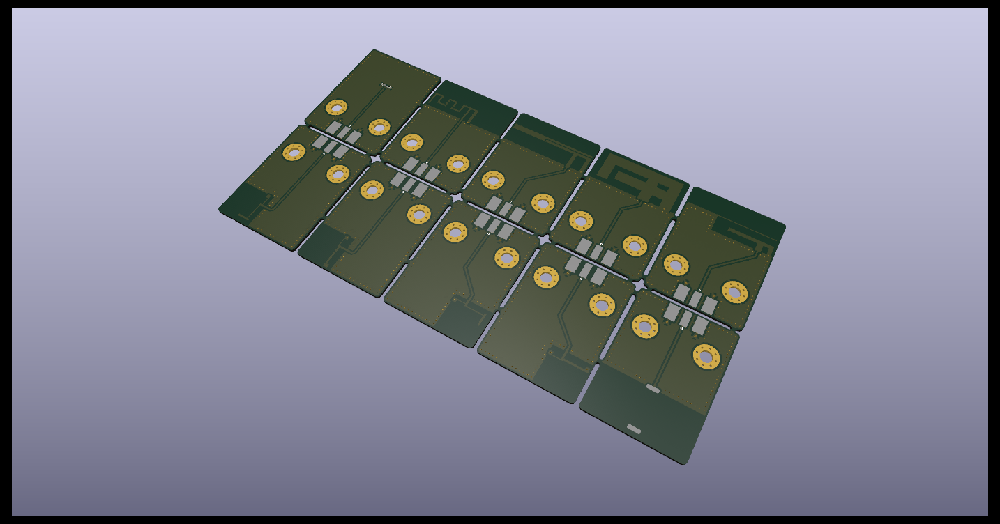

# Antenna Evaluation Board
Panel of test coupons with multiple antenna designs.

For KiCad *Version: 7.0.1, release build*

 

Browse the files on [KiCanvas](https://kicanvas.org/?github=https://github.com/cyber-murmel/antenna-evaluation-board/tree/main/source/antenna-evaluation-board) - by [Stargirl Flowers](https://github.com/theacodes)

## Directory Structure
| directory  | content                                                              |
|------------|----------------------------------------------------------------------|
| source     | KiCad project directories                                            |
| production | fabrication files (Gerber, BOM, placement)                           |
| exports    | schematic and layout plots, board 3D model and renderings            |
| datasheets | component datasheets                                                 |
| assets     | board setups, component 3D models, logos                             |
| scripts    | BOM export plugins, miscellaneous helper scripts for file conversion |
| hooks      | git hooks, for example for automatic documentation export            |

## Automation
This repository contains a Makefile that automates PDF and Gerber export.

### Requirements
Apart from [KiCad 7](#kicad-version) this requires some additional software.

The Makefile calls a Python script that makes use of [sexptdata](https://pypi.org/project/sexpdata/) to parse KiCad files.
Install [Poetry](https://python-poetry.org/) and run `poetry shell` followed by `poetry install` in the root of this repositoryto set up a virtual environment with the required package(s). To re-enter this environment, simply run `poetry shell` in the root of this repository.

For PDF export you additonally need to install [Poppler](https://poppler.freedesktop.org/).
Gerber export requires [zip](https://infozip.sourceforge.net/).

#### Nix(OS)
If you are using the Nix package manager, you can enter a development environment
with KiCad and all other software by running `nix-shell` in the root of this
repository.

### Export
To export all PDFs and production files, simply run
```shell
make
```
PDFs and production files are exported automatically when you `git commit`, if you have
[Git Hooks](#installing-git-hooks-optional) set up.

### Installing Git Hooks (optional)
The [hooks](hooks) directory contains client-side [git hooks](https://git-scm.com/book/en/v2/Customizing-Git-Git-Hooks).
Currently only the pre-commit hook is used to automatically export plots.

To enable the hooks locally, run the following in the root of the repository.
```shell
git config core.hooksPath ./hooks
```

## KiCad Version
Version information of the KiCad used to generate the files.
```
[nix-shell:~/repos/kicad-template]$ kicad-cli version --format about

Application: kicad-cli x86_64 on x86_64

Version: 7.0.1, release build

Libraries:
        wxWidgets 3.2.2
        FreeType 2.12.1
        HarfBuzz 6.0.0
        FontConfig 2.14.0
        libcurl/7.87.0 OpenSSL/3.0.8 zlib/1.2.13 brotli/1.0.9 zstd/1.5.2 libidn2/2.3.2 libssh2/1.10.0 nghttp2/1.51.0

Platform: , 64 bit, Little endian, wxBase, , wayland

Build Info:
        Date: Jan  1 1980 00:00:00
        wxWidgets: 3.2.2 (wchar_t,wx containers) GTK+ 0.0
        Boost: 1.79.0
        OCC: 7.6.2
        Curl: 7.87.0
        ngspice: 37
        Compiler: GCC 12.2.0 with C++ ABI 1017

Build settings:
        KICAD_USE_EGL=ON
        KICAD_SPICE=ON
```
